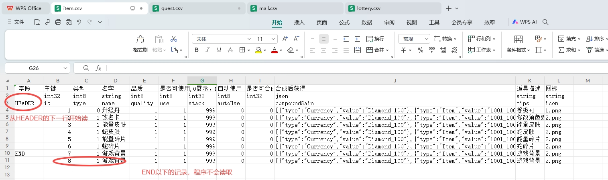
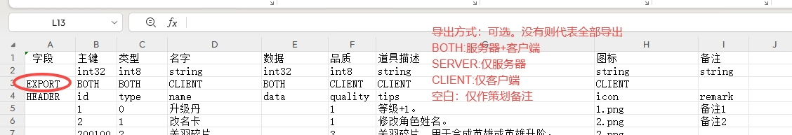
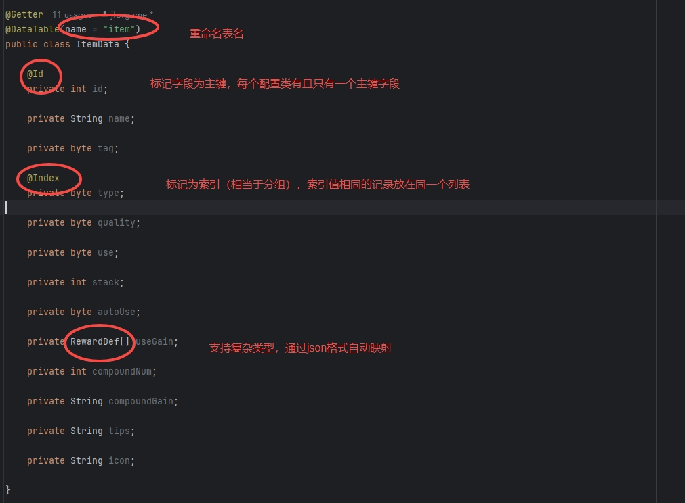
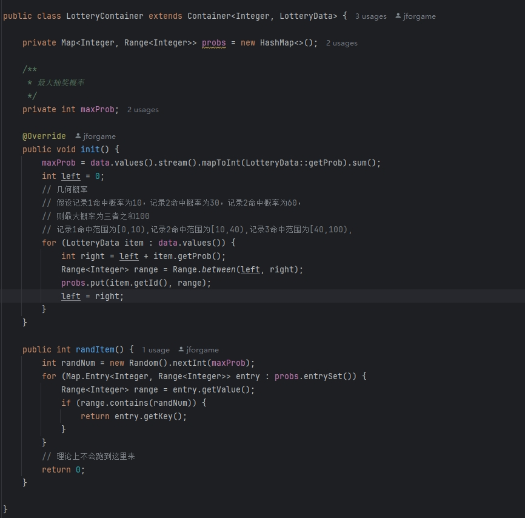

### Ⅰ. 简介

- jforgame-data-spring-boot-starter 是 `jforgame-data` 的 Spring Boot starter 装配模块
- `jforgame-data` 负责配置数据解析、容器装载、通用常量注入和数据校验等核心能力
- `jforgame-data-spring-boot-starter` 负责 Spring Boot 环境下的自动装配、属性绑定和默认 Bean 注册
- starter 中的 `ResourceProperties` 负责读取 `jforgame.data.*` 配置，并转换成 `jforgame-data` 中的普通配置对象 `ResourceOptions`
- 组件支持 csv/excel/json 格式
  一个普通的java类就代表一份csv/excel配置，类的每个实例代表文件的每一行记录
- 无需申明配置的字段类型，自动根据javabean的定义进行转换
- 支持二级缓存，无需任何额外代码解决配置热更缓存一致性问题

### Ⅱ. 模块关系

- 如果你不使用 Spring Boot，可直接依赖 `jforgame-data`，并自行创建 `ResourceOptions`、`DataReader`、`DataManager`
- 如果你使用 Spring Boot，直接依赖 `jforgame-data-spring-boot-starter` 即可
- 两者的职责边界如下：

| 模块 | 作用 |
| --- | --- |
| `jforgame-data` | 功能模块，提供配置读取、缓存装载、热更校验等核心能力 |
| `jforgame-data-spring-boot-starter` | 装配模块，负责 `ResourceProperties` 配置绑定、`ResourceOptions` 转换和自动注入 |


### Ⅲ. 自动映射

- HEADER行以上的记录程序不会读写，策划可自行添加，例如增加注释，字段类型等等
- HEADER行标记每个字段的名称，程序从HEADER所在行的下一行开始读取
- 程序读取到END所在的行结束，END行下面，即使有数据，程序也不会读取

  

- EXPORT所在的行为可选项,没有则代表所有字段都导出
- SERVER表示该字段为服务器使用，客户端不需要
- CLIENT表示该字段为客户端使用，服务器不需要
- BOTH表示该字段为服务器和客户端都需要
- 空白表示服务器和客户端均不需要,仅作策划备注

  

- Excel对应的Java类

  

  主要注解
- @DataTable 表明该类为配置类
- @Id 表明该自动为配置类的主键
- @Index 表明对该自动建立索引，相当于sql的group by分组  

### Ⅳ. 使用
- Spring Boot 环境组件引用
  ```
    <dependency>
        <groupId>io.github.jforgame</groupId>
        <artifactId>jforgame-data-spring-boot-starter</artifactId>
        <version>latest</version>
    </dependency>
  ```    
- 项目配置（application.yml文件）
   ```
  jforgame:
    data:
      ## 配置表实体扫描目录
      tableScanPath: org.jforgame.server.game.database.config
      ## 二级缓存Container扫描目录
      containerScanPath: org.jforgame.server.game.database.config
  ```

- 非 Spring Boot 环境下，可直接使用 `jforgame-data`，并自行构造 `ResourceOptions`
  ```java
  ResourceOptions options = new ResourceOptions();
  options.setLocation("csv/");
  options.setSuffix(".csv");
  options.setTableScanPath("org.jforgame.server.game.database.config");
  options.setContainerScanPath("org.jforgame.server.game.database.config");

  DataManager dataManager = new DataManager(options, dataReader);
  dataManager.init();
  ```

- 二级缓存, 默认容器只保存id与实体的映射，索引与实体列表的映射，如果程序需要用到二级缓存，只需继承Container类即可  

  

- 配置获取
  1. 获取单条记录
  ```
      // 查询id=1的数据
      ItemData itemData = GameContext.dataManager.queryById(ItemData.class, 1);
  ```
  2. 获取分组索引数据
  ```
      // 查询type=1的所有分组数据
      List<ItemData> itemDataList = GameContext.dataManager.queryByIndex(ItemData.class, "type", 1);
  ```
  3. 获取唯一索引数据
  ```
      // 查询type=1的所有分组数据
      HeroLevelData heroLevelData = GameContext.dataManager.queryByUniqueIndex(HeroLevelData.class, "index_id_level", "1_1");
  ```
  4. 获取二级缓存数据
  ```
      // 获取二级缓存数据
      QuestContainer container = GameContext.dataManager.queryContainer(QuestData.class, QuestContainer.class);
      Reward rewards = container.getRewardBy(1);
      System.out.println(JsonUtil.object2String(rewards));
  ```
  5. 配置热更
  ```
      for (String table : tables) {
          try {
              GameContext.dataManager.reload(table);
              succ.add(table);
          } catch (Exception e) {
              log.error("", e);
              failed.add(table);
          }
      }
      log.info("本次热更配置，成功为[{}],失败为[{}]", JsonUtil.object2String(succ), JsonUtil.object2String(failed));
  ```
